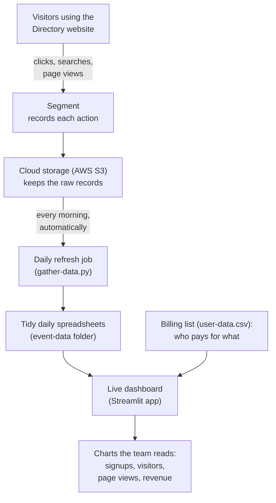

# Colorado Catholic Business Directory: Data and Analytics

This project is the behind-the-scenes engine that measures how people use the **Colorado Catholic Business Directory** website. The website itself is a separate product. It is a place where people in Colorado find Catholic-owned businesses, and where business owners pay to be listed. This repository does not run that website. Its job is to quietly record what visitors do, keep those records up to date on its own, and turn them into plain charts the team can read.

## What it helps you understand

The dashboard answers everyday business questions like these:

- How many businesses are signing up, and how many of those are paying versus free?
- How many people visit the site, and how often do they come back?
- How many pages does a typical visitor look at?
- How much revenue should we expect as paid listings come up for renewal?

## See it live: the dashboard

The dashboard is a web page with its own link. There is nothing to install and no code to run. You open the link in a browser and explore.

**Dashboard link:** https://co-catholic-business-directory-report.streamlit.app/

Once it loads, you can:

- Pick a date range, or use the quick buttons (this quarter, year to date, last week).
- Switch the charts between daily, weekly, and monthly views.
- Read the headline numbers (total signups, active users, page views) next to each chart.
- Download the revenue forecast as a spreadsheet using the download button.

## How the data gets here

Here is the journey each piece of data takes, from a visitor's click all the way to a chart on the dashboard. The whole middle section runs by itself every morning, so no one has to update anything by hand.

If you are reading this as plain text and the chart above looks like code, that is expected. When the file is viewed on GitHub, the block becomes a flowchart automatically. In words, the steps are: visitors act on the website, Segment records each action, the records land in cloud storage, a daily job tidies them into spreadsheets, and the dashboard combines those spreadsheets with the billing list to draw the charts.

Step by step:

1. **A visitor uses the website.** Every meaningful action gets noticed. That includes a page view, a search, a click on "visit website," or a business appearing in the results.
2. **Segment records it.** Segment is a tool that listens for those actions and writes them down in a consistent format. Think of it as a diligent note-taker.
3. **The notes go to cloud storage.** The raw records are saved in Amazon's online storage (called S3). This is the filing cabinet.
4. **A daily job tidies the new notes.** Each morning an automated task wakes up, pulls in only the new records, cleans them, and saves a dated spreadsheet into the `event-data` folder. Because it runs on a schedule, the data stays current without anyone lifting a finger.
5. **The dashboard reads everything.** The dashboard loads those spreadsheets, adds the billing list (who is on which plan), and draws the charts.

## What is in this folder

A quick tour, in plain terms:

- **`event-data/`** is the logbook: a collection of spreadsheets holding the recorded activity.
  - `ccbd-base.csv` is the large historical archive, meaning the back-catalog of older activity.
  - `ccbd-YYYY-MM-DD.csv` files are the daily updates added automatically each morning.
- **`user-data.csv`** is the billing list: which business is on a free, monthly, or yearly plan, and when each paid plan renews.
- **`programs/app.py`** is the dashboard itself.
- **`programs/gather-data.py`** is the morning refresh job that fetches and tidies new activity.
- **`notebooks/`** is the workshop. These are working files where the analysis was explored and built, such as gathering data, running queries, and grouping search terms. They are for development, not for daily use.
- The remaining files (`Pipfile`, `requirements.txt`, `runtime.txt`, and the workflow file under `.github/`) are setup and instructions for the computer. They make sure the right tools are installed and that the morning refresh runs on schedule.

## What gets recorded

The activity records describe how the site is used. In plain categories, they include:

- Pages viewed and searches run.
- Buttons clicked, such as "visit website" or "list your business."
- Which business listings appeared in the results, including whether a listing was sponsored.

## A small glossary

For anyone who wants to know what the technical names mean:

- **Segment:** a tool that records website activity in a consistent format.
- **AWS S3:** Amazon's online storage, used here as the filing cabinet for raw records.
- **CSV:** a plain spreadsheet file, the kind that opens in Excel or Google Sheets.
- **Streamlit:** the tool that turns the analysis into the interactive dashboard web page.
- **GitHub Action:** the scheduler that runs the morning refresh automatically.
- **DuckDB:** the tool the dashboard uses to crunch the numbers quickly behind the scenes.
